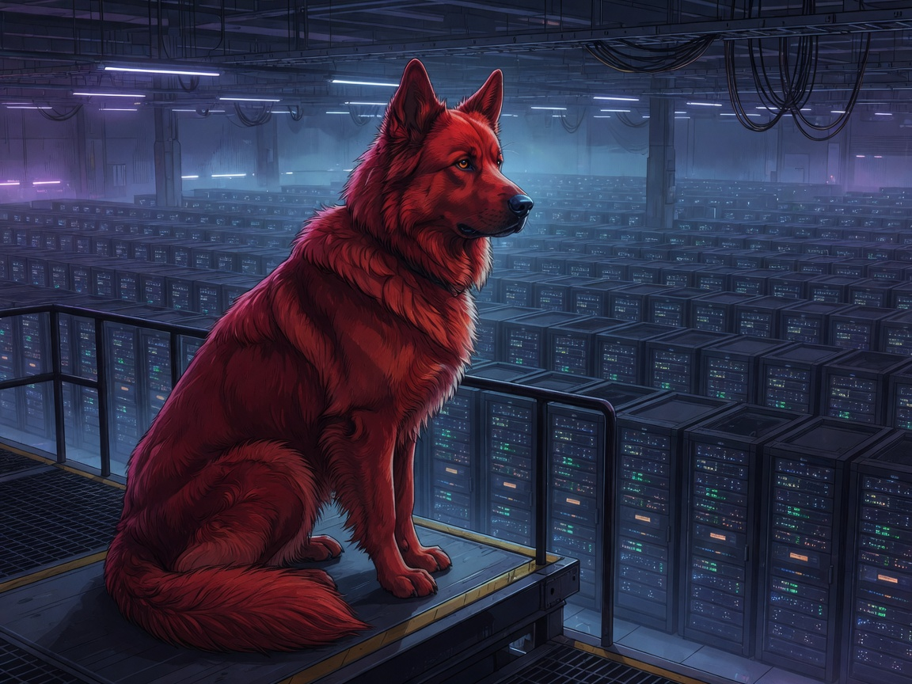

# CrashDog



Lightweight crash-forensics daemon for headless Debian servers. CrashDog writes frequent, fsynced, human-readable snapshots so you can see what the system was doing before an unlogged hard reset.

## Why CrashDog exists

On HAL (Jun 8, 2026), the system rebooted at 10:43 AM with no shutdown record. The journal stopped at 10:17 AM with only routine cron entries. No kernel panic, OOM, or thermal event was logged.

CrashDog fills the gap between **journald** (often incomplete on power loss) and **atop** (10-minute binary snapshots).

## Existing Debian tools (comparison)

| Tool | Role | Gap |
|------|------|-----|
| **atop** | Deep 10-min system/process/GPU history | Binary format; no crash summary |
| **sysstat** | CPU/mem/disk/network history | No per-process detail |
| **rasdaemon** | Hardware MCE/memory errors | No system state |
| **watchdog** | Hang detection and recovery | Not forensics |
| **journald** | General logging | Often lost on hard power loss |

**Recommendation:** Run CrashDog alongside `atop` and `rasdaemon`.

## What CrashDog logs

Every 60 seconds (configurable):

- uptime, load, memory, swap
- top CPU and memory processes
- new dmesg errors/warnings since last tick
- NVIDIA GPU temp/memory/utilization (if present)
- Docker container status summary

On boot after an abnormal shutdown:

- `CRASH_GAP` entry with previous boot ID, last snapshot time, estimated gap, and atop replay hint

On clean shutdown (`SIGTERM`):

- `CLEAN_SHUTDOWN` marker so the next boot is not flagged as a crash

## Quick start

```bash
git clone https://github.com/datagod/crashdog.git
cd crashdog
sudo ./install.sh
```

Optional: skip atop/rasdaemon if already configured:

```bash
sudo INSTALL_ATOP=0 INSTALL_RASDAEMON=0 ./install.sh
```

To update after code changes:

```bash
cd crashdog   # your clone directory
sudo ./fix-install.sh
```

## Usage

```bash
# Status report (default command)
crashdog

# Service status
systemctl status crashdog

# Tail today's log
tail -f /var/log/crashdog/crashdog-$(date +%Y%m%d).log

# Last fsynced snapshot (survives crashes)
cat /var/log/crashdog/last-snapshot.txt

# Replay atop around last snapshot time (if atop installed)
atop -r /var/log/atop/atop_$(date +%Y%m%d) -b 1017
```

## Configuration

`/etc/crashdog/config.yaml` (defaults in `crashdog.default.yaml`):

```yaml
log_dir: /var/log/crashdog
interval_seconds: 60
top_processes: 5
keep_days: 14
collectors:
  processes: true
  dmesg: true
  gpu: true
  docker: true
```

## Log format

```
2026-06-08T10:16:45-04:00 SNAPSHOT uptime=1d3h37m load=1.2/0.9/0.8 mem=5.6/47G swap=0.0/23G gpu=gpu0=44C/3260MiB/0% docker_up=9 docker_exit=2 top=frigate,immich dmesg_new=0
2026-06-08T10:43:22-04:00 CRASH_GAP prev_boot=4b6949bc... new_boot=560a1f58... last_snapshot=2026-06-08T10:16:45-04:00 gap_est=26m atop_hint="atop -r /var/log/atop/atop_20260608 -b 1016"
```

## Limitations

- On instant power loss, only the **last fsynced snapshot** is guaranteed. Reduce `interval_seconds` for finer resolution.
- Does not capture kernel panics unless paired with **pstore/ramoops**.
- Does not replace hardware error logging — use **rasdaemon** for MCE events.

## Project layout

```
CrashDog/
├── crashdog.py
├── collectors/
├── crashdog.default.yaml
├── crashdog.service
├── install.sh
└── README.md
```